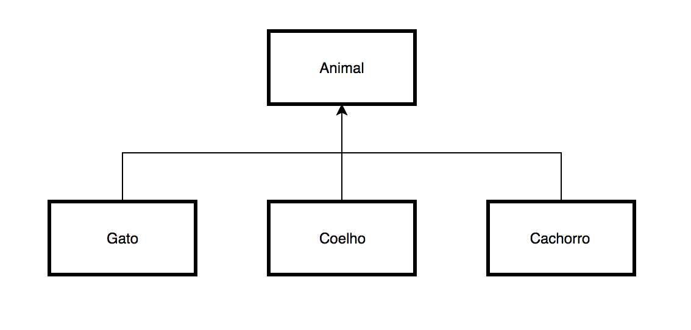

# Aula 10 - Herança

## Herança entre classes

Herança é o relacionamento entre classes, no qual uma classe "herda" os menbros (atributos e métodos) de outra classe.

A classe existente que fornece os recursos para a nova classe é chamada de superclasse e a nova classe de subclasse.

### Superclasse direta e superclasse indireta

A superclasse direta é a classe que a suclasse herda diretamente, e a superclasse indireta é qualquer superclasse acima da classe direta na hierarquia de classes.

No java só é permitdo que cada classe tenha apenas uma superclasse direta.

